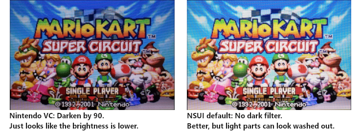
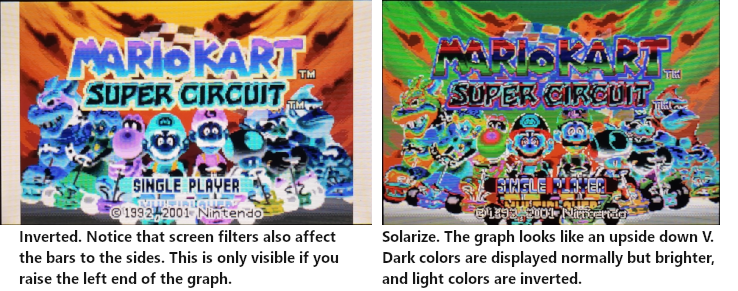
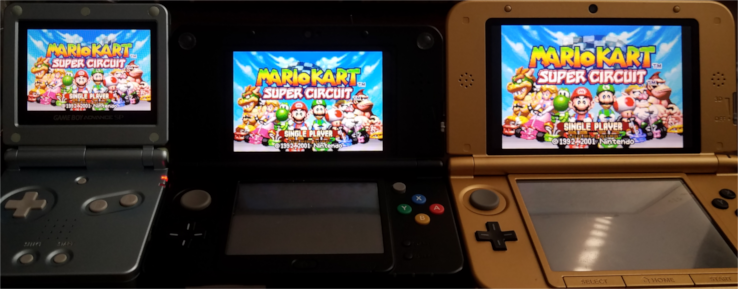

# agb_edit: Edit existing 3DS GBA VCs
This is an interactive Windows command line tool that can display info, dump or edit GBA VCs that use AGB\_FIRM. It supports both NSUI GBA injects and official Nintendo Ambassador Program VCs, and preserves manuals or other attached extras when editing.

## Operation
Pass one or more GBA VC cia files on the command line, or drag them onto agb\_edit's icon. It will guide you through its various options in a keyboard-driven menu system. The following sections describe each function in the main menu. Note that the *progfiles* folder must be in the same directory as agb\_edit.exe since I didn't want to re-implement all the cia, cxi and exefs dumping and building stuff that [3dstool](https://github.com/dnasdw/3dstool), [ctrtool and makerom](https://github.com/3DSGuy/Project_CTR) already do.

#### Preset quick fix cia(s)
Just want to quickly fix your GBA VCs and not mess with edit mode? Look no further. Drag your cias onto agb\_edit.exe and press P when it asks what you want to do. This is what it changes:
 * Remove any ghosting and dark filter
 * Use gamma correction that approximates the colors of a "*New! Brighter screen!*" GBA SP AGS-101 (gamma 2.2 => 1.54)
 * Set sleep button combo to L+R+Select, the default buttons for the sleep patch from NSUI and what the builtin "basic sleep" option in Yoshi's Island and some other games use

#### Analyze cia(s)
This is the simplest function. It just displays a bunch of info about the input file(s). All the other functions display the same info, but this only shows the info. To reduce confusion, I recommend only analyzing one cia at a time.

The first block of info shown following "==> progfiles\ctrtool.exe..." is ctrtool showing info about the cia header itself. Unless you're into 3DS internals, the only useful bit of info here is the Title ID.

The second info block, following "==== DUMPING INFO FROM FOOTER ====" is a dump of everything in the GBA-VC-specific ROM footer. The formatting reflects how the data structures are arranged and linked together in the footer. The most interesting parts are:
 * __Save type__: If this doesn't match the type of save your ROM actually uses, saving won't work correctly. This program cannot currently edit this if it's wrong, but I'm planning to add that in a future version.
 * __Sleep buttons__: AGB\_FIRM has an optional feature that will press a button combination when you close the 3DS's lid, in order to activate a game's sleep function or sleep patch so you can have a normal sleep function on GBA games. The buttons it will press are set here. I couldn't find any tools that can set this, so I wrote this program.
   * *NOTE: This does NOT set what buttons will activate sleep. The system will blindly press the buttons configured here, at the same time. They might or might not activate a sleep function, but that's the obvious use case.*
 * __Video LUT (Look-Up Table)__: This is a color filter. Nintendo's VCs as well as NSUI only use it to implement the darken filter, but it can be made to do so much more -- really, it can do anything that GIMP or Photoshop's "curves" filter can do. This program dumps the values in hexadecimal and then draws a small graph on the terminal that's arranged the same as the one in the curves tool: the X axis is input subpixel value, and the Y axis is the output value. A straight line from the bottom left to the top right corresponds to "no darken filter", while a darken filter will move the top end of the line downward.
   * *Technically speaking, it's a list of 256 triplets of bytes. Inside each triplet, the first byte is for the red channel, the second blue, and the third green. The first triplet says the values to give to each channel when the game outputs a pixel for that channel with a value of 0/black, and so forth up to 255/fully lit.*
 * __LCD ghosting__: This controls how much simulated screen ghosting / anti-flicker / motion blur the system applies to this game. Many GBA games used flickering to create transparency effects. Since the 3DS has a faster screen, you can see the flicker. This simulates having a slower screen, converting the flicker into properly rendered transparency. But it can also make fast-moving game elements harder to see. The number is shown in decimal and hex, and smaller numbers down to 1 mean a heavier ghosting effect, while 255 (0xff) results in no ghosting. Most people want 255, while Nintendo's VCs use 128 (0x80), 144 (0x90) or 192 (0xc0) depending on the game.

#### Extract files from cia(s)
This is really only interesting if you want to poke at 3DS internals. It dumps the contents of the cia and its exefs into a directory in the same place as the cia, with the name of the cia, but with .dump instead of .cia. You'll find 3 layers of extracted files in there. The cia contents are named file.xxxx.yyyyyyyy where x's and y's are numbers indicating its index in the cia. Typically an NSUI inject will have 1 of these; and a Nintendo VC will have 2, with the first being the game and the other being the manual. Then the main one is extracted to a number of .bin files. And then exefs.bin is extracted into an exefs directory inside the .dump directory. Note that code.bin in the exefs directory is the GBA ROM plus the AGB\_FIRM footer.

#### Dump GBA ROM(s)
Want the ROM out of your GBA VC game? Use this option. It will extract a file next to the cia, with the same name, but with the .gba extension. You can drag a bunch of them into this program at once to batch extract.

#### Edit cia(s)
This extracts one or more cias, makes some changes, and rebuilds them. When you select this, you'll answer a series of prompts before it does anything. For simple yes/no questions, you can press Y or N, or Q to abort and quit the program directly.

First it will ask if you want to set a lid-close button combo. If you answer yes, it will ask you to enter what buttons to press. Button names are not case sensitive, and you can separate them with either spaces or +'s. For example, "L R SELECT" is what you want for the default NSUI sleep patch configuration. The order you type button names in makes no difference since it presses them all at once. If sleep buttons are already set in a cia and you want to get rid of them, answer yes and then leave the button list blank.

Answering no makes it leave whatever sleep button configuration is already in the cia(s).

Then it asks if you want to edit video parameters, and if you say yes it goes into a different menu where you can change various parameters and then accept the result when you're happy with it.

Options in the video parameter (screen filter) editor menu:
 * __A - Change the color channel you're editing__ - You can edit each color channel separately if you like. The default is all channels.
 * __B - Brightness (intercept)__ - Raises or lowers the whole graph. If parts of it go above or below the graph, they will be clipped to the top or bottom. The default is 0. This is the *b* in *y=mx+b*.
 * __C - Contrast (slope)__ - This makes the line steeper or shallower. The dark filter Nintendo and NSUI use change this. The default is 1. Lower or higher numbers raise or lower the right end of the line without moving the left end. This is the *m* in *y=mx+b*.
 * __D - Dark filter__ - Just a shortcut way to set the contrast value, where 0 is unmodified and 255 is darkened all the way down so everything is black.
 * __I - Change input gamma__ - For gamma correction. Input gamma should approximate the gamma of a GBA screen, or otherwise what you think the game's art was designed on. Open\_agb\_firm suggests 2.2 for this.
 * __O - Change output gamma__ - For gamma correction. Output gamma should approximate the gamma of the 3DS screen. Open\_agb\_firm suggests 1.54, which seems about right in my testing but sometimes feels like it's a hair too low. Note that if input and output gamma are the same, no matter what absolute value they are, the gamma is unchanged. A higher output gamma than input gamma make the graph line curve gently upward, while a lower output gamma makes it curve downward.
 * __V - Invert colors amount__ - A simple invert/negative filter. 1 means normal colors, -1 is inverted colors. Possibly useful if you want a dark mode in a game that's mostly white. You can use numbers between -1 and 1, but they just make it tend toward gray and then into inverted colors.
 * __S - Solarize amount__ - Solarize filter. 0 is normal and 1 is solarized. Numbers in between are a blend of the two.
 * __W - Set white point color__ - As it says. It will prompt you for each of red, green and blue, which can each be between 0 (black) and 1 (fully lit). (Note, this affects all channels regardless of your active channel.)
 * __T - Set color temperature__ - Sets the white point to a value calculated from a color temperature. As with Luma3DS, the default is 6500 k. Put a lower value to get a blue light filter. (Note, this affects all channels regardless of your active channel.)
 * __X - Set maXimum/ceiling__ - If the line goes above this value, clip it to this value. The default of 255 makes it not clip unless it goes outside the graph.
 * __N - Set miNimum/floor__ - If the line goes below this value, clip it to this value. The default of 0 makes it not clip unless it goes outside the graph.
 * __G - Set LCD ghosting/anti-flicker/motion blur__ - Set the ghosting value. 1 (0x01) is maximal ghosting, and 255 (0xff) is minimal. You can enter either in decimal or hex, but to enter hex, write "0x" before the number. Note that the program will not modify this value in the cia unless you select this option and enter a value.
 * __R - Reset params__ - Set all of the above except for ghosting to default values. It will ask whether you want to reset to the default gamma-corrected (input 2.2 output 1.54) preset, or a plain linear one with no gamma correction.
 * __K - OK! Done!__ - Leaves this menu. The program will set the video LUT to what you see.
 * __Q - Back to previous menu, abandon all parameter changes other than ghosting__ - Leaves this menu, and cancels making changes to the video LUT. It does NOT cancel any change you made to the ghosting value. To change ghosting without overwriting the LUT, use this option after you set ghosting.

Finally it lists everything it's going to change and ask to make sure you want to make the changes. If you accept, it will scroll a bunch of stuff as it extracts, analyzes, modifies and repacks each cia you've given it. If you press N, it will quit without doing anything.

## Examples
Here are some examples of what screen filters you can make using the above parameters. All of these are on the title screen of *Mario Kart Super Circuit*, running on an old 3DS XL (the *Zelda: Link Between Worlds* one). Screen pictures are taken with a Galaxy S7 Edge, in "pro" camera mode, with all fixed settings so the pictures are comparable.

And here is a single-shot comparison showing the game on a GBA SP (AGS-101 / the "New! Brighter Screen!" model), a New 3DS non-XL, and an old 3DS XL, with the brightness matched as best I can.

## Building

 * To build agb_edit.exe: `make`
 * For a debug binary, agb_edit_dbg.exe: `make debug`
 * To clean -- deletes the exe if it exists: `make clean`

It's intended to be built using mingw32/64-gcc and MSYS2, but if you don't use these it should be fairly easy to adapt the few commands in the makefile to your build environment. You do *not* need any 3DS-specific libraries or tools, other than the 3 external exes in progfiles. My code uses standard C runtime libraries, although making it work on non-Windows platforms would at least require changing a number of Windows-specific commands run using `system()`.

`make` and `make debug` just require `gcc` to be on your %PATH%. Since it's a small program, I just feed all source files into a single invocation of the compiler. `make clean` uses `rm`. Both of these should be easy to adapt to a different compiler or to use the Windows `del` command instead of `rm`.
